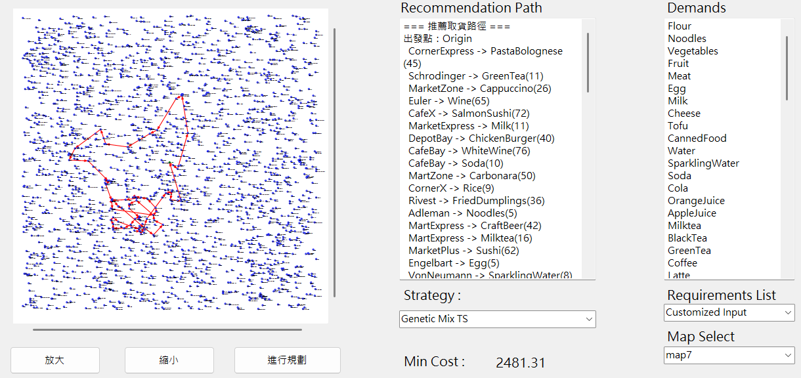
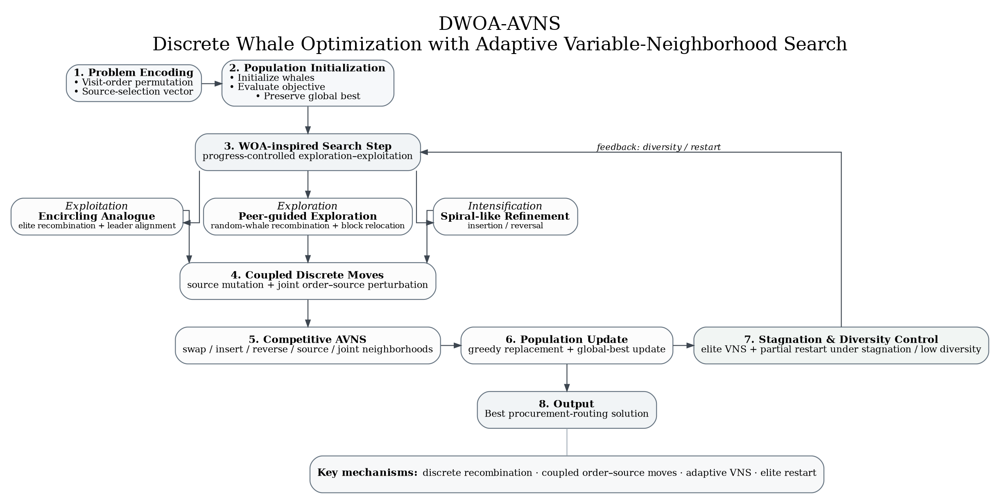
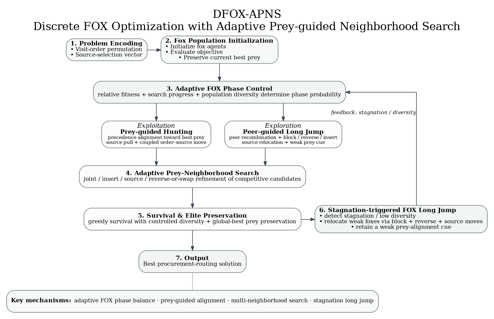
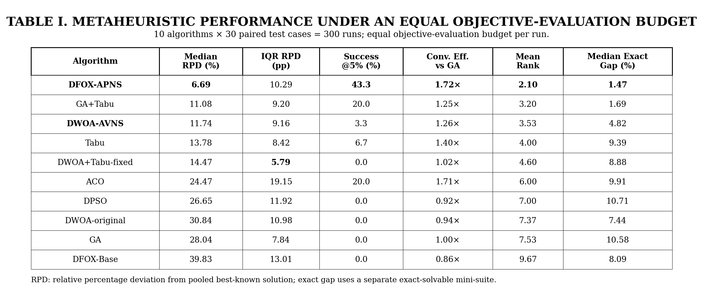

# PANCAKE — Discrete Metaheuristic Optimization Study

**PANCAKE** (*Pathfinding for Acquisition of Necessary Commodities using Algorithmic Knowledge Efficiently*) began as a C# route-planning GUI and was reorganized into a compact research study on **discrete metaheuristic design**. Each solution contains two coupled decisions: a commodity visit permutation and one selected source for every commodity. The scalarized objective is

\[
f(x)=C_{purchase}+\lambda D_{travel},\qquad \lambda=0.25.
\]

The study focuses on how continuous or population-based metaheuristics should be reinterpreted when the search space is combinatorial. In particular, it develops **DWOA-AVNS** and a new FOX-based method, **DFOX-APNS**, rather than directly applying continuous update equations to permutations.

## GUI Demonstration



*Figure 1. English C# WinForms interface. The GUI can load the legacy maps and all research maps, execute the implemented algorithms on a worker task, and visualize the resulting procurement route.*

## Research Design

Ten solvers are evaluated: **GA, Tabu Search, GA+Tabu, ACO, DPSO, DWOA-original, corrected DWOA+Tabu, DWOA-AVNS, DFOX-Base, and DFOX-APNS**. DFOX-Base is intentionally simple: it maps the original FOX optimizer's fixed 50/50 exploration–exploitation decision to discrete route/source moves. DFOX-APNS then replaces that direct mapping with adaptive prey-guided search, coupled neighborhoods, and stagnation-triggered long jumps.

The reported test benchmark contains **5 landscape families × 2 maps × 3 paired seeds × 10 algorithms = 300 runs**, with exactly **1,200 objective evaluations per run**. The five families are Uniform, Clustered, Price–Distance Conflict, Shared Hubs, and Deceptive Groups. A separate seven-demand exact-solvable mini-suite measures true optimality gaps. DFOX-APNS population size was selected on **10 disjoint development maps** (indices 3–4); all reported test results use maps 1–2.

### Algorithm Design Figures



*Figure 2. DWOA-AVNS flowchart. The method combines discrete WOA analogues with coupled source–order moves, competitive AVNS, and stagnation/diversity-triggered restart.*



*Figure 3. DFOX-APNS flowchart. The method converts FOX prey-guided hunting into adaptive discrete exploration/exploitation, prey-neighborhood refinement, and stagnation-triggered long jumps.*

### Evaluation Metrics

- **RPD (%)** = `100 × (f − f_BKS) / f_BKS`, where `f_BKS` is the pooled best-known value for the same map. Lower is better; BKS is not claimed to be the global optimum.
- **IQR RPD** measures dispersion of final RPD and therefore run-to-run robustness. Lower is better.
- **Success@5%** is the percentage of runs finishing within 5% of the pooled BKS. Higher is better.
- **Convergence AUC** integrates best-so-far RPD over normalized objective-evaluation budget. The table reports **GA-relative convergence efficiency = AUC_GA / AUC_method**; values above 1× indicate faster/sustained progress than GA under the same evaluation count.
- **Mean Rank** is the average paired rank across the 30 map-seed cases, reducing sensitivity to map-specific objective scales. Lower is better.
- **Exact Gap (%)** = `(f − f*) / f* × 100` on the independent small exact-solvable suite, where `f*` is obtained by dynamic programming.

## Table 1 — Complete Comparison

| Algorithm | Median RPD ↓ | IQR RPD ↓ | Success@5% ↑ | Conv. Eff. vs GA ↑ | Mean Rank ↓ | Exact Gap* ↓ |
|---|---:|---:|---:|---:|---:|---:|
| **DFOX-APNS** | **6.69** | 10.29 | **43.3** | **1.72×** | **2.10** | **1.47** |
| GA+Tabu | 11.08 | 9.20 | 20.0 | 1.25× | 3.20 | 1.69 |
| **DWOA-AVNS** | 11.74 | 9.16 | 3.3 | 1.26× | 3.53 | 4.82 |
| Tabu | 13.78 | 8.42 | 6.7 | 1.40× | 4.00 | 9.39 |
| DWOA+Tabu-fixed | 14.47 | **5.79** | 0.0 | 1.02× | 4.60 | 8.88 |
| ACO | 24.47 | 19.15 | 20.0 | 1.71× | 6.00 | 9.91 |
| DPSO | 26.65 | 11.92 | 0.0 | 0.92× | 7.00 | 10.71 |
| DWOA-original | 30.84 | 10.98 | 0.0 | 0.94× | 7.37 | 7.44 |
| GA | 28.04 | 7.84 | 0.0 | 1.00× | 7.53 | 10.58 |
| DFOX-Base | 39.83 | 13.01 | 0.0 | 0.86× | 9.67 | 8.09 |

`*` Exact Gap is measured on the separate exact-solvable mini-suite. Friedman test across the 30 paired main-benchmark cases: **p = 1.81 × 10⁻³¹**. Paired Wilcoxon tests show DFOX-APNS differs from DFOX-Base (**p = 1.86 × 10⁻⁹**) and DWOA-AVNS (**p = 0.0016**); its comparison with GA+Tabu is **p = 0.0606**, so this pilot does not claim statistically significant superiority over that strong hybrid.



## Table 2 — Mean Final Cost on Representative Test Maps

Each cell is the mean final objective over three seeds. Raw costs should be compared **within the same map column only**, because different maps have different objective scales.

| Algorithm | U-01 | C-01 | PDC-01 | SH-01 | DG-01 |
|---|---:|---:|---:|---:|---:|
| **DFOX-APNS** | 1458.81 | **1434.92** | **1546.83** | 1163.45 | **767.26** |
| GA+Tabu | **1317.74** | 1464.39 | 1602.53 | 1226.04 | 867.62 |
| DWOA-AVNS | 1451.60 | 1500.03 | 1656.47 | 1203.48 | 823.56 |
| Tabu | 1469.37 | 1507.92 | 1631.03 | 1312.85 | 856.11 |
| DWOA+Tabu-fixed | 1438.21 | 1581.92 | 1625.06 | 1288.20 | 979.04 |
| ACO | 1785.90 | 1695.35 | 1849.68 | **1150.03** | 890.37 |
| DPSO | 1598.77 | 1642.65 | 1701.10 | 1351.39 | 1064.42 |
| DWOA-original | 1671.39 | 1701.65 | 1799.81 | 1379.01 | 1054.85 |
| GA | 1636.00 | 1725.44 | 1793.76 | 1327.00 | 1147.24 |
| DFOX-Base | 1749.17 | 1840.01 | 1927.49 | 1523.29 | 1318.21 |

## Findings

**1. A direct continuous-to-discrete FOX mapping was insufficient.** DFOX-Base retained the original FOX-style fixed phase split but reached **39.83% median RPD**. After introducing adaptive prey-guided neighborhoods, coupled order/source moves, diversity-aware exploration, and stagnation-triggered long jumps, DFOX-APNS reached **6.69% median RPD**, an **83.2% reduction** relative to DFOX-Base.

**2. Problem-specific operator semantics mattered more than the swarm metaphor alone.** DWOA-AVNS reduced median RPD from **30.84% to 11.74%**, a **61.9% reduction** over the original DWOA. The analogous improvement in FOX supports the same interpretation: discrete representations require meaningful neighborhood operators instead of literal continuous motion equations.

**3. Search landscape changed the strongest method.** GA+Tabu remained strongest on the representative Uniform map, ACO exploited Shared-Hub structure effectively, while DFOX-APNS was strongest on the representative Clustered, Price–Distance Conflict, and Deceptive maps. The study therefore treats algorithm selection as a landscape-dependent question rather than a universal ranking exercise.

**4. Convergence speed and final quality were not identical objectives.** ACO achieved strong evaluation-based convergence efficiency but substantially worse final RPD. This distinction motivated the use of RPD, Success@5%, convergence AUC, rank, and exact gap together rather than reporting only runtime or one final cost.

## Source Layout

- `ResearchBenchmark/algorithms/dfox_base.py` — direct discrete FOX baseline.
- `ResearchBenchmark/algorithms/dfox_apns.py` — canonical DFOX-APNS implementation used in reported tables.
- `ResearchBenchmark/algorithms/dwoa_avns.py` — canonical DWOA-AVNS implementation.
- `ResearchBenchmark/dev_datasets/` and `meta_results/fox_population_screen.csv` — disjoint FOX development-screen artifacts.
- `Experiment_Maps/` — exact JSON test instances plus GUI-compatible CSV copies.
- `CSharp_GUI/` — English WinForms application and interactive C# ports of the research algorithms.
- `Academia_Discussion/` — per-algorithm academic interpretation, with full design rationale and pseudocode for DWOA-AVNS and DFOX-APNS.
- `docs/figures/PANCAKE_algorithms.dot` — editable Graphviz source for the combined DWOA-AVNS / DFOX-APNS flowchart.
- `docs/figures/DWOA_AVNS_algorithm.dot` and `DFOX_APNS_algorithm.dot` — standalone editable flowcharts used by the README figures.

## Reproduction

```bash
cd ResearchBenchmark
pip install -r requirements.txt
python fox_parameter_screen.py   # development-only FOX setting screen
python meta_study.py             # 300-run reported test benchmark
python export_report.py          # tables + paper-style PNG
```

The study is intended as a **small reproducible algorithmic investigation**, not evidence that one metaheuristic is universally superior. Its main contribution is the analysis of how representation, neighborhood semantics, exploration/exploitation control, and landscape structure interact in a coupled discrete optimization problem.

## Key References

- H. M. Mohammed and T. A. Rashid, **FOX: a FOX-inspired optimization algorithm**, *Applied Intelligence*, 2022. DOI: `10.1007/s10489-022-03533-0`.
- M. A. Jumaah, Y. H. Ali, and T. A. Rashid, **An improved FOX optimization algorithm using adaptive exploration and exploitation for global optimization**, *PLOS ONE*, 2025. DOI: `10.1371/journal.pone.0331965`.
- S. Mirjalili and A. Lewis, **The Whale Optimization Algorithm**, *Advances in Engineering Software*, 2016. DOI: `10.1016/j.advengsoft.2016.01.008`.
- F. Luan et al., **Optimizing the Low-Carbon Flexible Job Shop Scheduling Problem with Discrete Whale Optimization Algorithm**, *Mathematics*, 2019. DOI: `10.3390/math7080688`.
